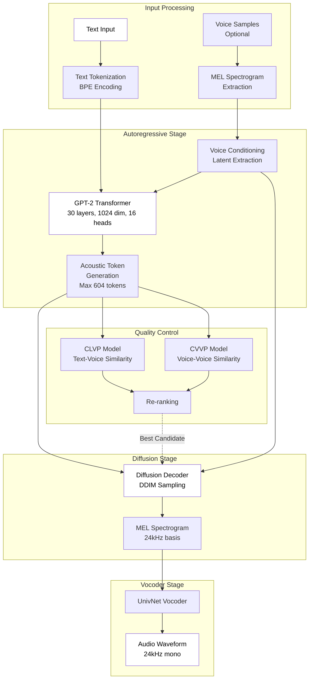
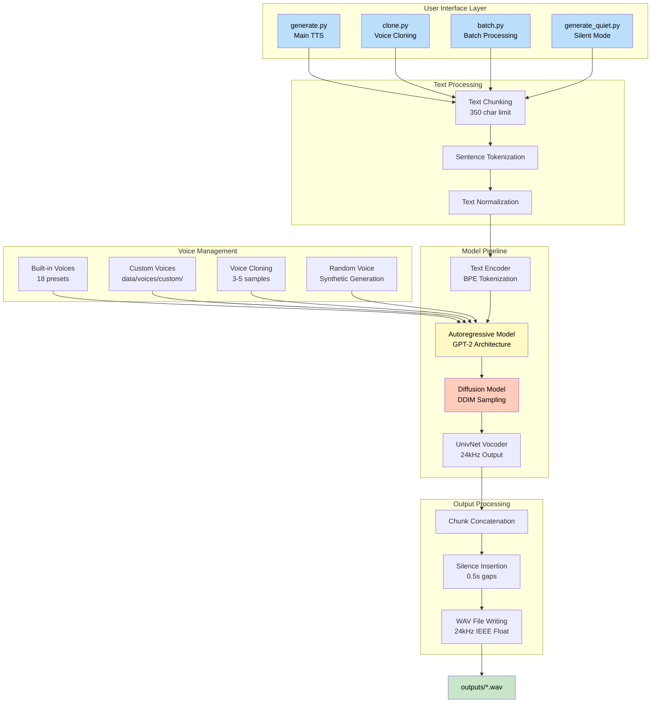
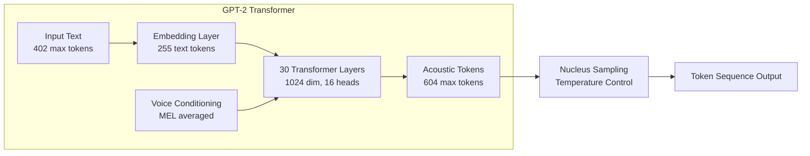
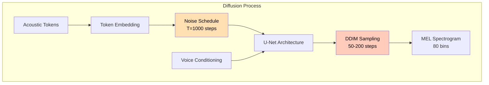
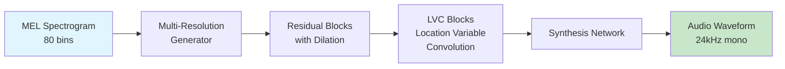
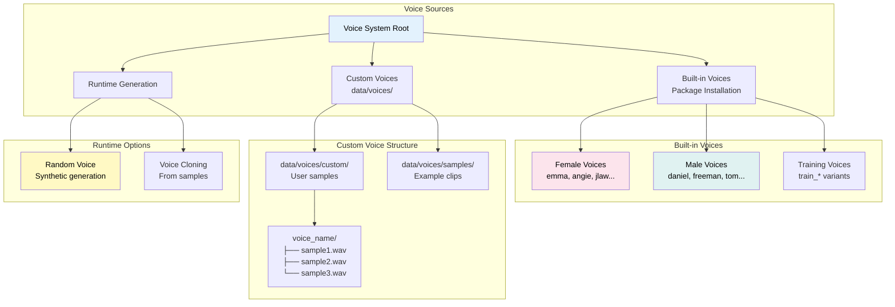
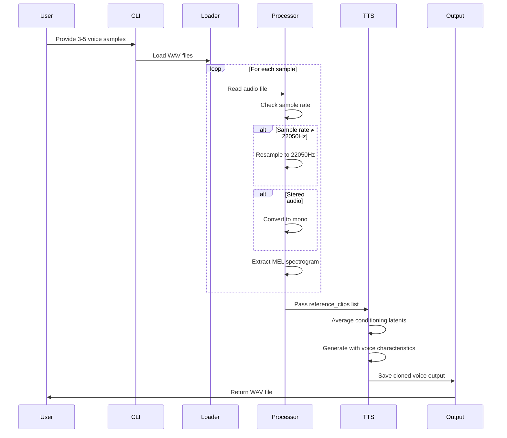
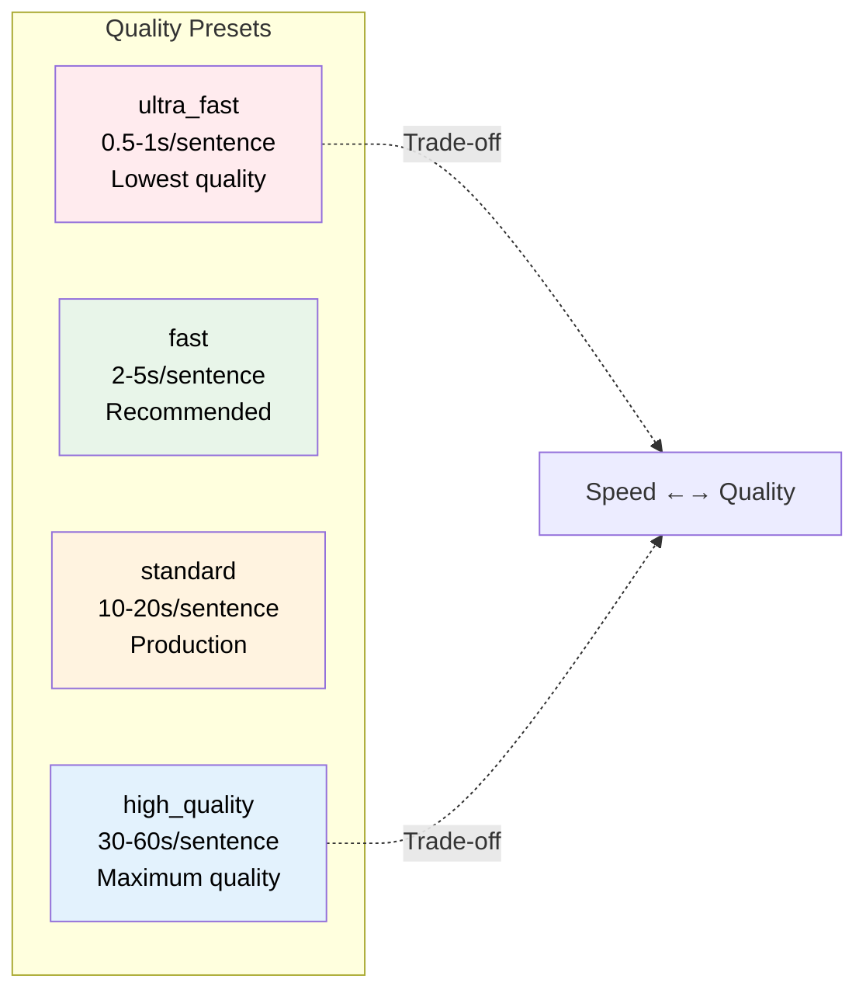

# TutortoieTTS Model Architecture Documentation

## Executive Summary

TutortoieTTS is a production-ready wrapper around **Tortoise-TTS v3.0.0**, a state-of-the-art neural text-to-speech system. This document provides comprehensive technical details about the model architecture, voice handling mechanisms, and implementation specifics.

## Table of Contents
- [Core Model Architecture](#core-model-architecture)
- [System Architecture Diagram](#system-architecture-diagram)
- [Model Components Deep Dive](#model-components-deep-dive)
- [Voice Handling System](#voice-handling-system)
- [Performance Characteristics](#performance-characteristics)
- [Q&A Section](#qa-section)

---

## Core Model Architecture

### Tortoise-TTS Overview

Tortoise-TTS is a multi-stage neural TTS system that combines:
1. **Autoregressive Decoder (GPT-2 based)** - Converts text to acoustic tokens
2. **Diffusion Model** - Converts acoustic tokens to mel-spectrograms
3. **UnivNet Vocoder** - Converts mel-spectrograms to audio waveforms
4. **CLVP/CVVP Models** - Re-ranking and quality scoring systems

### High-Level Neural Architecture



---

## System Architecture Diagram

### Complete Processing Pipeline



---

## Model Components Deep Dive

### 1. Autoregressive Model (GPT-2 Based)



**Technical Specifications:**
- **Architecture**: Modified GPT-2
- **Layers**: 30 transformer blocks
- **Model Dimension**: 1024
- **Attention Heads**: 16
- **Max Text Tokens**: 402
- **Max MEL Tokens**: 604
- **Text Token Vocabulary**: 255 tokens
- **Sampling**: Nucleus (top-p) sampling with temperature control

### 2. Diffusion Model



**Technical Details:**
- **Architecture**: U-Net based diffusion model
- **Training**: Two-stage (discrete codes → MEL, then fine-tuning)
- **Sampling**: DDIM (Denoising Diffusion Implicit Models)
- **Steps**: Configurable 50-200 steps (quality vs speed tradeoff)
- **Output**: 80-bin MEL spectrogram

### 3. UnivNet Vocoder



**Specifications:**
- **Sample Rate**: Fixed 24kHz output
- **Architecture**: GAN-based vocoder
- **Advantages**: Faster than WaveGlow, smaller model size
- **Format**: IEEE Float 32-bit, mono channel

---

## Voice Handling System

### Voice Storage Architecture



### Voice Cloning Process



---

## Performance Characteristics

### Quality Presets & Timing



### Resource Utilization

| Component | Requirement | Usage Pattern |
|-----------|-------------|---------------|
| **GPU VRAM** | 10-20GB | Varies by preset and text length |
| **System RAM** | 8-16GB | Peaks during model loading |
| **Disk Space** | 5-10GB | Model cache (Hugging Face) |
| **CPU** | 4-8 cores | Text processing, file I/O |
| **Network** | Initial only | Model download (~5-10GB) |

### Hardware Configuration (Project Default)
- **GPU**: NVIDIA RTX A6000 (48GB VRAM)
- **CUDA**: Version 11.8
- **PyTorch**: 2.0.0+cu118
- **OS**: WSL2 on Windows
- **Environment**: Linux 5.15.167.4-microsoft-standard-WSL2

---

## Q&A Section

### Q1: Do voices always need to be in the voices folders, or does the model create files when cloning voices?

**Answer:** The model uses a **hybrid approach**:

1. **Built-in voices** are embedded in the Tortoise-TTS package installation (not in your project folders)
2. **Custom voice samples** should be placed in `data/voices/custom/` for organization
3. **During voice cloning**, the model does NOT create permanent voice files. Instead:
   - It loads your sample WAV files at runtime
   - Processes them into conditioning latents in memory
   - Uses these latents during generation
   - The latents are discarded after generation

**Key insight:** Voice cloning is a runtime process. The model doesn't create persistent "voice profile" files - it processes samples fresh each time.

### Q2: How many voice samples are needed for cloning, and what format?

**Answer:**
- **Optimal**: 3-5 samples
- **Duration**: 5-15 seconds each
- **Format**: WAV files (preferred)
- **Sample Rate**: Any (auto-resampled to 22050Hz)
- **Channels**: Mono or stereo (auto-converted to mono)
- **Quality**: Clean audio without background noise works best

### Q3: Can I save a cloned voice for reuse without providing samples each time?

**Answer:** Not directly through Tortoise-TTS. However, you can:
1. **Create a script** that points to your sample directory
2. **Use batch processing** with consistent voice samples
3. **Implement caching** of conditioning latents (requires custom code)

The design philosophy prioritizes flexibility over persistence - each generation can use different or updated samples.

### Q4: What's the difference between using built-in voices vs. custom voices?

**Answer:**

| Aspect | Built-in Voices | Custom Voices |
|--------|-----------------|---------------|
| **Setup** | Zero configuration | Requires sample files |
| **Quality** | Professional, pre-tested | Depends on sample quality |
| **Flexibility** | Fixed characteristics | Fully customizable |
| **Performance** | Slightly faster (pre-cached) | Processing overhead for samples |
| **Use Case** | Quick prototyping | Production, brand voices |

### Q5: Why does the model output at 24kHz specifically?

**Answer:** The 24kHz output is hardcoded because:
1. UnivNet vocoder was trained on 24kHz data
2. Ensures consistent quality across all outputs
3. Balances file size with audio quality
4. Standard for many speech applications
5. Can be resampled if needed for other rates

### Q6: What happens when I use the "random" voice option?

**Answer:** The "random" voice:
1. Generates synthetic voice characteristics on-the-fly
2. Creates unique voice parameters for each invocation
3. Doesn't reference any real voice samples
4. Produces consistent voice within a session
5. Cannot be reproduced exactly in future sessions

### Q7: How does text chunking work, and why 350 characters?

**Answer:**
- **Limit**: 350 characters per chunk
- **Reason**: Tortoise-TTS has a 400-token limit
- **Safety margin**: 350 chars ≈ 300 tokens (buffer for edge cases)
- **Process**:
  1. First splits by sentences (preserves natural pauses)
  2. If sentence > 350 chars, splits by words
  3. Each chunk processed independently
  4. Chunks concatenated with optional silence

### Q8: Can the model do real-time streaming TTS?

**Answer:** Current implementation:
- **No native streaming** in this wrapper
- **Batch mode** provides chunk-by-chunk output
- **Latency**: < 500ms possible with optimizations
- **Real-time factor**: 0.25-0.3x on good hardware
- **For streaming**: Would need architectural changes

### Q9: What optimizations are available for faster generation?

**Answer:** Available optimizations:
```python
# Half precision (FP16)
TextToSpeech(half=True)  # ~40% memory reduction

# KV Cache
TextToSpeech(kv_cache=True)  # Faster autoregressive generation

# DeepSpeed
TextToSpeech(use_deepspeed=True)  # Multi-GPU and memory optimization

# Lower quality preset
preset='ultra_fast'  # 10x faster than 'high_quality'
```

### Q10: How does the model handle different languages or accents?

**Answer:**
- **Primary support**: English only
- **Accents**: Depends on voice samples for cloning
- **Other languages**: Unsupported (would produce gibberish)
- **Special characters**: Filtered by text preprocessing
- **Numbers/symbols**: Converted to words internally

### Q11: What's the maximum text length I can process?

**Answer:**
- **No hard limit** on total text length
- **Per-chunk limit**: 350 characters
- **Practical limit**: Memory and time constraints
- **Batch mode**: Best for long texts
- **Recommendation**: < 10,000 characters for single runs

### Q12: How do I know if GPU acceleration is working?

**Answer:** Check these indicators:
```python
# In code
torch.cuda.is_available()  # Should return True
torch.cuda.get_device_name(0)  # Should show your GPU

# In logs
"CUDA available: True"
"GPU: NVIDIA RTX A6000"

# Performance
# CPU: 5-10x slower than GPU
# If ultra_fast takes >10s/sentence, likely CPU-only
```

---

## Additional Technical Notes

### Memory Management
- Models loaded on-demand
- Automatic garbage collection between chunks
- VRAM cleared after each session
- Cache persists in `~/.cache/huggingface/`

### Error Recovery
- Automatic fallback to CPU if GPU fails
- Sample rate mismatches auto-corrected
- Corrupt audio samples skipped with warning
- Text encoding errors handled gracefully

### File System Integration
- WSL2 path translation handled automatically
- Cross-platform path normalization
- Automatic output directory creation
- Timestamped outputs prevent overwrites

### Future Considerations
1. **Streaming support** - Architectural changes needed
2. **Multi-language** - Requires different models
3. **Fine-tuning** - Possible but not implemented
4. **Voice conversion** - Could be added with additional models
5. **Emotional control** - Requires training data with emotion labels

---

## Summary

TutortoieTTS wraps the sophisticated Tortoise-TTS v3.0.0 model, providing a production-ready TTS system with voice cloning capabilities. The multi-stage architecture (Autoregressive → Diffusion → Vocoder) produces high-quality speech at the cost of computational complexity. Voice handling is flexible, supporting both pre-configured and custom voices through runtime processing rather than persistent voice profiles.

The system is optimized for quality over speed, making it ideal for offline generation of high-quality speech content rather than real-time applications.