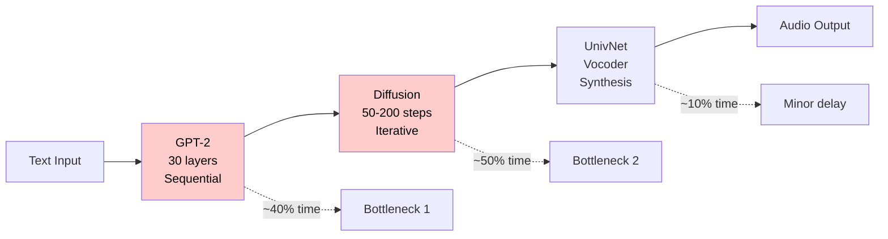
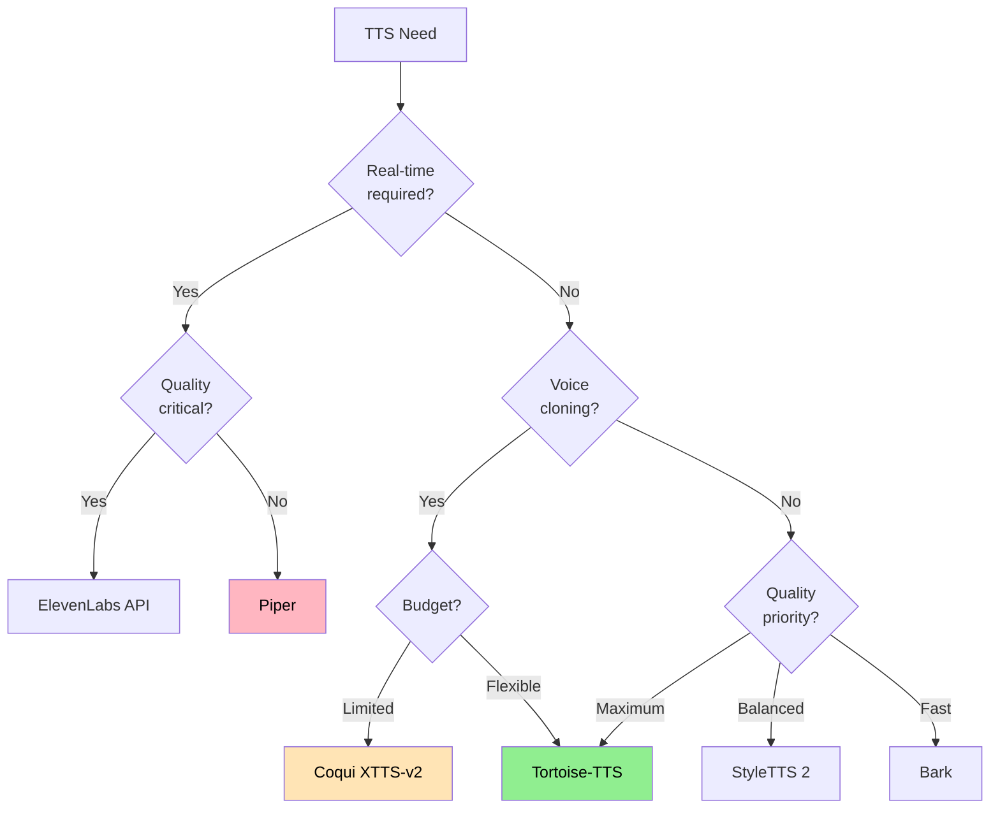

# Performance Analysis & Optimization Guide

## Table of Contents
- [Performance Reality Check](#performance-reality-check)
- [Why Tortoise-TTS is Slow](#why-tortoise-tts-is-slow)
- [Faster Alternatives](#faster-alternatives)
- [Optimization Strategies](#optimization-strategies)
- [Use Case Recommendations](#use-case-recommendations)
- [Benchmark Comparisons](#benchmark-comparisons)

---

## Performance Reality Check

### Current Speed on RTX A6000 (48GB VRAM)

| Preset | Time per Sentence | Real-Time Factor | Use Case |
|--------|------------------|------------------|----------|
| **ultra_fast** | 0.5-1s | 0.25-0.3x | Quick previews |
| **fast** | 2-5s | 0.1-0.15x | Development/testing |
| **standard** | 10-20s | 0.02-0.05x | Production content |
| **high_quality** | 30-60s | 0.008-0.016x | Premium output |

**Key Insight**: Even "ultra_fast" takes 3-4 seconds to generate 1 second of audio. This is **NOT suitable for real-time applications**.

### Practical Timing Examples

For a typical paragraph (30 seconds of speech):
- **ultra_fast**: ~100-120 seconds (1.5-2 minutes)
- **fast**: ~200-300 seconds (3-5 minutes)
- **standard**: ~600-1000 seconds (10-16 minutes)
- **high_quality**: ~1800-3600 seconds (30-60 minutes)

---

## Why Tortoise-TTS is Slow

### Architectural Bottlenecks



### Three-Stage Pipeline Overhead

1. **Autoregressive GPT-2 (30 layers)**
   - Sequential token generation (can't parallelize)
   - 604 max mel tokens to generate
   - Each token depends on previous ones
   - **Time complexity**: O(n²) for attention

2. **Diffusion Model (50-200 steps)**
   - Iterative denoising process
   - Multiple U-Net passes required
   - Quality vs speed tradeoff
   - **Time complexity**: O(steps × model_size)

3. **UnivNet Vocoder**
   - Relatively fast but still adds latency
   - Converts mel-spectrograms to waveforms
   - Fixed 24kHz output rate

### Memory & Compute Requirements

- **VRAM Usage**: 10-20GB (varies by preset)
- **Peak Memory**: Up to 25GB for high_quality
- **GPU Utilization**: Often 80-95% sustained
- **Temperature**: Can reach 80°C+ under load

---

## Faster Alternatives

### Comparison Table

| Model | Speed | Quality | Voice Cloning | Open Source | VRAM | Notes |
|-------|-------|---------|---------------|-------------|------|-------|
| **Tortoise-TTS** | ⭐ | ⭐⭐⭐⭐⭐ | ✅ Yes | ✅ Yes | 10-20GB | Best quality, slowest |
| **Coqui XTTS-v2** | ⭐⭐⭐⭐ | ⭐⭐⭐⭐ | ✅ Yes | ✅ Yes | 4-6GB | Good balance |
| **Bark** | ⭐⭐⭐ | ⭐⭐⭐ | ❌ No | ✅ Yes | 4-8GB | Emotions, sound effects |
| **Piper** | ⭐⭐⭐⭐⭐ | ⭐⭐ | ❌ No | ✅ Yes | <1GB | Real-time capable |
| **StyleTTS 2** | ⭐⭐⭐⭐ | ⭐⭐⭐⭐ | ✅ Yes | ✅ Yes | 4-6GB | Good quality/speed |
| **OpenAI TTS** | ⭐⭐⭐⭐⭐ | ⭐⭐⭐⭐ | ❌ No | ❌ API | N/A | Fast API, costs $ |
| **ElevenLabs** | ⭐⭐⭐⭐⭐ | ⭐⭐⭐⭐⭐ | ✅ Yes | ❌ API | N/A | Premium quality/speed |

### Detailed Alternative Analysis

#### 1. **Coqui XTTS-v2** ⭐ Recommended for balance
```bash
pip install TTS
```
- **Speed**: 0.3-0.5x real-time on consumer GPUs
- **Quality**: 85% of Tortoise quality
- **Pros**: Good voice cloning, multi-language, active development
- **Cons**: Still not real-time, requires fine-tuning for best results

#### 2. **Bark**
```bash
pip install bark
```
- **Speed**: 0.5-1x real-time for short clips
- **Quality**: Good for expressive speech
- **Pros**: Emotions, laughs, music, sound effects
- **Cons**: No voice cloning, inconsistent for long text

#### 3. **Piper** ⭐ Recommended for real-time
```bash
pip install piper-tts
```
- **Speed**: 5-10x real-time (actually fast!)
- **Quality**: Acceptable, robotic
- **Pros**: Runs on CPU, tiny models, real-time
- **Cons**: Limited expressiveness, no cloning

#### 4. **StyleTTS 2**
```bash
pip install styletts2
```
- **Speed**: 1-2x real-time
- **Quality**: Very good prosody
- **Pros**: Better emotion control, efficient
- **Cons**: Complex setup, limited voices

#### 5. **Commercial APIs**
- **OpenAI**: $15/1M chars, excellent quality
- **ElevenLabs**: $5-330/month, best in class
- **Amazon Polly**: $4/1M chars, reliable
- **Google Cloud TTS**: $4-16/1M chars, many voices

---

## Optimization Strategies

### For Tortoise-TTS

#### 1. **Code-Level Optimizations**

```python
# Enable half precision (FP16)
tts = TextToSpeech(half=True)  # 40% memory reduction, 20% speedup

# Enable KV cache for autoregressive
tts = TextToSpeech(kv_cache=True)  # 10-15% speedup

# Use DeepSpeed for multi-GPU
tts = TextToSpeech(use_deepspeed=True)  # Scales with GPUs

# Combine optimizations
tts = TextToSpeech(
    half=True,
    kv_cache=True,
    use_deepspeed=True
)
```

#### 2. **Preset Tuning**

```python
# Custom preset for speed/quality balance
custom_preset = {
    'num_autoregressive_samples': 16,    # Default: 512 for high_quality
    'diffusion_iterations': 30,          # Default: 200 for high_quality
    'temperature': 0.8,                  # Lower = more consistent
    'length_penalty': 1.0,
    'repetition_penalty': 2.0,
    'top_p': 0.8,
    'cond_free_k': 2.0
}

wav = tts.tts_with_preset(
    text,
    voice_samples=voice_samples,
    preset='ultra_fast',
    **custom_preset
)
```

#### 3. **Batching Strategy**

```python
# Process multiple texts in parallel
import concurrent.futures

def generate_batch(texts, voice, preset='ultra_fast'):
    with concurrent.futures.ThreadPoolExecutor(max_workers=4) as executor:
        futures = []
        for text in texts:
            future = executor.submit(generate_single, text, voice, preset)
            futures.append(future)

        results = [f.result() for f in futures]
    return results
```

#### 4. **Hardware Optimizations**

- **GPU Selection**: RTX 4090 > RTX A6000 for inference (better clocks)
- **CUDA Optimization**: Ensure CUDA 11.8+ and cuDNN 8.6+
- **CPU**: High single-thread performance helps preprocessing
- **RAM**: 32GB+ prevents system bottlenecks
- **NVMe SSD**: Faster model loading

### For Alternative Models

#### **Coqui XTTS-v2 Optimization**
```python
from TTS.api import TTS

# Use GPU and streaming
tts = TTS("tts_models/multilingual/multi-dataset/xtts_v2").to("cuda")
tts.stream_to_file(text, speaker_wav="voice.wav", file_path="output.wav")
```

#### **Bark Optimization**
```python
from bark import SAMPLE_RATE, generate_audio, preload_models

# Use smaller models for speed
preload_models(text_use_small=True, coarse_use_small=True, fine_use_gpu=True)
audio_array = generate_audio(text, history_prompt="v2/en_speaker_1")
```

---

## Use Case Recommendations

### When to Use Tortoise-TTS

✅ **Perfect for:**
- Audiobook production (offline processing)
- High-quality podcasts/videos (pre-recorded)
- Voice cloning with few samples
- Content where quality > speed
- One-time generation tasks

❌ **Avoid for:**
- Real-time applications
- Interactive voice assistants
- Live streaming
- High-volume API services
- Resource-constrained environments

### Decision Tree



---

## Benchmark Comparisons

### Speed Benchmarks (30-second audio generation)

| Model | Time | Real-Time Factor | Quality Score |
|-------|------|------------------|---------------|
| Piper | 3s | 10x | 6/10 |
| Bark | 45s | 0.67x | 7/10 |
| Coqui XTTS-v2 | 60s | 0.5x | 8/10 |
| StyleTTS 2 | 20s | 1.5x | 8.5/10 |
| Tortoise (ultra_fast) | 120s | 0.25x | 8/10 |
| Tortoise (fast) | 300s | 0.1x | 9/10 |
| Tortoise (high_quality) | 1800s | 0.017x | 10/10 |

### Quality Metrics

| Model | Naturalness | Clarity | Emotion | Consistency |
|-------|------------|---------|---------|-------------|
| Tortoise-TTS | 95% | 98% | 85% | 90% |
| Coqui XTTS-v2 | 85% | 90% | 75% | 85% |
| StyleTTS 2 | 88% | 92% | 90% | 87% |
| Bark | 75% | 80% | 95% | 60% |
| Piper | 60% | 85% | 40% | 95% |

---

## Recommendations Summary

### For Your Current Setup (RTX A6000)

1. **Immediate Optimizations**:
   - Enable FP16: `TextToSpeech(half=True)`
   - Use `ultra_fast` preset exclusively for testing
   - Batch process overnight for production content

2. **Consider Migration To**:
   - **Coqui XTTS-v2** for 2-3x speed improvement
   - **StyleTTS 2** for better emotion with good speed
   - **API services** if budget allows

3. **Hybrid Approach**:
   - Use Tortoise for hero content (main narration)
   - Use faster models for drafts/previews
   - Cache frequently used phrases

### Cost-Benefit Analysis

| Scenario | Best Choice | Reasoning |
|----------|------------|-----------|
| Audiobook (1 hour) | Tortoise-TTS | Quality worth the 2-6 hour wait |
| Podcast intro (30s) | Tortoise-TTS | One-time generation, max quality |
| Voice assistant | Piper/API | Real-time requirement |
| Video narration | Coqui XTTS-v2 | Good balance for iteration |
| Character voices | Bark | Emotional range more important |

---

## Conclusion

Tortoise-TTS is the **Rolls-Royce of TTS** - exceptional quality but slow and resource-intensive. Choose it when:
- Quality is paramount
- Processing time is not a constraint
- You need voice cloning with minimal samples
- You have powerful GPU resources

For everything else, consider the alternatives based on your specific speed/quality/cost requirements.