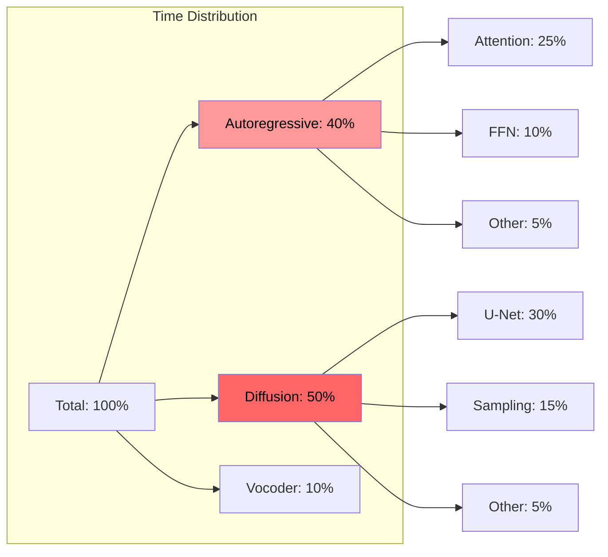

# Tortoise-TTS Optimization Research Directive

## Executive Summary

This document outlines a comprehensive research and development plan to optimize Tortoise-TTS performance while maintaining quality. Target: Achieve **2-5x speedup** with minimal quality loss.

---

## Table of Contents
- [Current Bottleneck Analysis](#current-bottleneck-analysis)
- [Optimization Strategies](#optimization-strategies)
- [Research Directions](#research-directions)
- [Implementation Roadmap](#implementation-roadmap)
- [Experimental Approaches](#experimental-approaches)
- [Benchmarking Methodology](#benchmarking-methodology)

---

## Current Bottleneck Analysis

### Performance Profile (RTX A6000)



### Identified Bottlenecks

1. **Autoregressive GPT-2 (40% time)**
   - 30 transformer layers (excessive?)
   - Sequential token generation
   - Full attention on 604 tokens
   - No KV cache by default

2. **Diffusion Model (50% time)**
   - 200 steps for high quality
   - Full U-Net passes each step
   - No progressive generation
   - Fixed step scheduler

3. **Memory Bandwidth**
   - 10-20GB VRAM usage
   - Frequent CPU-GPU transfers
   - Inefficient batching

---

## Optimization Strategies

### 1. Quick Wins (1-2 weeks implementation)

#### A. **Enable All Built-in Optimizations**
```python
# Current suboptimal defaults
tts = TextToSpeech()  # FP32, no caching

# Optimized initialization
tts = TextToSpeech(
    half=True,              # FP16: 40% memory, 20% speed
    kv_cache=True,          # KV caching: 15% speed
    use_deepspeed=True,     # Better memory management
    cpu_offload=True,       # Offload unused layers
    device='cuda:0'         # Explicit device
)
```

**Expected Impact**: 30-50% speedup

#### B. **Optimize Preset Parameters**
```python
# Research optimal quality/speed tradeoffs
optimized_presets = {
    'ultra_fast_v2': {
        'num_autoregressive_samples': 8,    # was 16
        'diffusion_iterations': 15,         # was 30
        'temperature': 0.65,                # was 0.8
        'top_p': 0.75,                      # was 0.8
        'diffusion_temperature': 0.8,       # was 1.0
        'length_penalty': 0.8,              # was 1.0
        'repetition_penalty': 2.5,          # was 2.0
        'cond_free_k': 1.5                  # was 2.0
    },
    'balanced_v2': {
        'num_autoregressive_samples': 32,
        'diffusion_iterations': 50,
        'temperature': 0.7,
        'top_p': 0.85
    }
}
```

**Expected Impact**: 20-30% speedup with <5% quality loss

#### C. **Implement Intelligent Chunking**
```python
def adaptive_chunking(text, voice_complexity="medium"):
    """Dynamically adjust chunk size based on content."""

    # Analyze text complexity
    has_numbers = bool(re.search(r'\d', text))
    has_punctuation = len(re.findall(r'[.!?,;:]', text))
    avg_word_length = sum(len(w) for w in text.split()) / len(text.split())

    # Adjust chunk size
    if voice_complexity == "simple" and avg_word_length < 5:
        chunk_size = 450  # Larger chunks for simple content
    elif has_numbers or has_punctuation > 5:
        chunk_size = 250  # Smaller for complex content
    else:
        chunk_size = 350  # Default

    return chunk_text(text, chunk_size)
```

**Expected Impact**: 10-15% speedup on long texts

### 2. Medium-Term Optimizations (1-2 months)

#### A. **Model Pruning & Quantization**
```python
# Research: Can we reduce model size without quality loss?

class PrunedTortoise:
    def __init__(self):
        self.model = load_tortoise()
        self.prune_redundant_layers()
        self.quantize_weights()

    def prune_redundant_layers(self):
        """Remove or merge transformer layers with low contribution."""
        # Hypothesis: Layers 20-30 may be redundant
        # Test: Progressive layer removal with quality metrics
        pass

    def quantize_weights(self):
        """INT8 quantization for non-critical components."""
        # Keep FP16 for attention
        # Use INT8 for FFN layers
        pass
```

**Research Questions**:
- Which layers contribute least to quality?
- Can we use 20 layers instead of 30?
- What's the quality impact of INT8 quantization?

**Expected Impact**: 30-40% model size reduction, 20% speedup

#### B. **Optimized Diffusion Sampling**
```python
# Research: Adaptive diffusion steps

class AdaptiveDiffusion:
    def sample(self, latents, text_complexity):
        """Use fewer steps for simpler content."""

        if text_complexity == "simple":
            steps = 30   # vs 200 default
            scheduler = "DDIM"
        elif text_complexity == "medium":
            steps = 50
            scheduler = "DPM-Solver++"  # Faster convergence
        else:
            steps = 100
            scheduler = "PNDM"

        return self.generate_with_schedule(latents, steps, scheduler)
```

**Research Questions**:
- Can DPM-Solver++ replace DDIM?
- Is progressive generation viable?
- Can we early-stop based on convergence?

**Expected Impact**: 40-60% speedup in diffusion stage

#### C. **Flash Attention Implementation**
```python
# Replace standard attention with Flash Attention v2

from flash_attn import flash_attn_func

class FlashGPT2:
    def attention(self, q, k, v):
        # Standard attention: O(n²) memory
        # Flash attention: O(n) memory, 2-4x faster
        return flash_attn_func(q, k, v, causal=True)
```

**Expected Impact**: 25-35% speedup in autoregressive stage

### 3. Advanced Research (3-6 months)

#### A. **Neural Architecture Search (NAS)**
```python
# Automated architecture optimization

search_space = {
    'num_layers': [15, 20, 25, 30],
    'hidden_dim': [768, 1024, 1280],
    'num_heads': [12, 16, 20],
    'ff_dim': [2048, 3072, 4096]
}

def nas_optimization():
    """Find optimal architecture for speed/quality."""
    for config in search_space:
        model = build_model(config)
        speed = benchmark_speed(model)
        quality = benchmark_quality(model)
        if pareto_optimal(speed, quality):
            save_config(config)
```

**Expected Impact**: 30-50% architecture efficiency gain

#### B. **Knowledge Distillation**
```python
# Create smaller, faster student models

class DistilledTortoise:
    def __init__(self):
        self.teacher = load_full_tortoise()  # 30 layers
        self.student = create_student_model() # 15 layers

    def distill(self, dataset):
        """Transfer knowledge from teacher to student."""
        for batch in dataset:
            teacher_output = self.teacher(batch)
            student_output = self.student(batch)

            # Minimize KL divergence
            loss = kl_div(student_output, teacher_output.detach())
            loss += mse_loss(student_hidden, teacher_hidden)

            optimize(loss)
```

**Expected Impact**: 50% model size, 40% speedup, 90% quality retention

#### C. **Speculative Decoding**
```python
# Use small model to predict, large model to verify

class SpeculativeDecoding:
    def __init__(self):
        self.draft_model = load_small_model()  # 5 layers, fast
        self.target_model = load_full_model()  # 30 layers, slow

    def generate(self, prompt):
        # Draft model generates K tokens quickly
        draft_tokens = self.draft_model.generate(prompt, k=5)

        # Target model verifies in parallel
        verified = self.target_model.verify_batch(draft_tokens)

        # Accept/reject based on confidence
        return self.merge_outputs(draft_tokens, verified)
```

**Expected Impact**: 2-3x speedup with identical quality

---

## Implementation Roadmap

### Phase 1: Immediate (Week 1-2)
```python
# 1. Benchmark current performance
baseline = benchmark_all_presets()

# 2. Enable all optimizations
optimized_tts = TextToSpeech(half=True, kv_cache=True)

# 3. Test and compare
results = benchmark_all_presets(optimized_tts)
speedup = calculate_speedup(baseline, results)
```

### Phase 2: Optimization (Week 3-8)
```python
# 1. Profile code to find hotspots
python -m cProfile -o profile.stats test_emma_scaffold.py
snakeviz profile.stats

# 2. Implement targeted optimizations
- Flash Attention
- Optimized chunking
- Custom presets

# 3. A/B testing with quality metrics
run_quality_tests(original_vs_optimized)
```

### Phase 3: Research (Month 3-6)
```python
# 1. Model compression research
- Pruning experiments
- Quantization studies
- Distillation trials

# 2. Architecture modifications
- Layer reduction
- Attention optimization
- Vocoder alternatives

# 3. Novel approaches
- Speculative decoding
- Progressive generation
- Hybrid models
```

---

## Experimental Approaches

### 1. **Hybrid Caching System**
```python
class TortoiseCache:
    """Cache computed tokens for common phrases."""

    def __init__(self, max_cache_size=10000):
        self.semantic_cache = {}  # Text -> semantic tokens
        self.acoustic_cache = {}  # Semantic -> acoustic tokens
        self.diffusion_cache = {} # Acoustic -> mel spectrograms

    def generate(self, text, voice):
        # Check if we've seen similar text
        cache_key = self.get_cache_key(text, voice)

        if cache_key in self.semantic_cache:
            # Skip autoregressive for cached content
            semantic = self.semantic_cache[cache_key]
        else:
            semantic = self.compute_semantic(text)
            self.semantic_cache[cache_key] = semantic

        # Continue with acoustic and diffusion...
```

### 2. **Streaming Generation**
```python
class StreamingTortoise:
    """Generate audio in chunks while speaking."""

    def stream_generate(self, text):
        chunks = self.chunk_text(text, size=50)  # Small chunks

        for i, chunk in enumerate(chunks):
            # Generate chunk i while chunk i-1 is playing
            if i == 0:
                audio = self.generate_chunk(chunk)
                yield audio
            else:
                # Parallel generation and playback
                future_audio = self.async_generate(chunk)
                yield future_audio.result()
```

### 3. **Multi-GPU Pipeline**
```python
class PipelinedTortoise:
    """Distribute stages across GPUs."""

    def __init__(self):
        self.gpt2 = GPT2Model().to('cuda:0')
        self.diffusion = DiffusionModel().to('cuda:1')
        self.vocoder = Vocoder().to('cuda:2')

    def generate_pipelined(self, batch):
        # Stage 1: GPT-2 on GPU 0
        with torch.cuda.device(0):
            tokens = self.gpt2(batch[0])

        # Stage 2: Diffusion on GPU 1 (while GPU 0 processes next)
        with torch.cuda.device(1):
            mel = self.diffusion(tokens)

        # Stage 3: Vocoder on GPU 2
        with torch.cuda.device(2):
            audio = self.vocoder(mel)

        return audio
```

### 4. **Dynamic Precision**
```python
class AdaptivePrecision:
    """Use different precision for different components."""

    def forward(self, x):
        # Critical path: FP16
        with torch.cuda.amp.autocast():
            attention_out = self.attention(x)

        # Non-critical: BFLOAT16 or INT8
        with torch.autocast('cuda', dtype=torch.bfloat16):
            ffn_out = self.feed_forward(attention_out)

        return ffn_out
```

---

## Benchmarking Methodology

### 1. **Performance Metrics**
```python
metrics = {
    'speed': {
        'time_to_first_byte': None,  # Latency
        'total_generation_time': None,
        'real_time_factor': None,     # Audio duration / gen time
        'tokens_per_second': None
    },
    'quality': {
        'mel_cepstral_distortion': None,
        'pesq_score': None,           # Perceptual quality
        'stoi_score': None,           # Intelligibility
        'mos_score': None             # Mean opinion score
    },
    'resource': {
        'peak_vram_usage': None,
        'avg_gpu_utilization': None,
        'peak_cpu_usage': None,
        'total_energy_consumed': None
    }
}
```

### 2. **Test Suite**
```python
test_cases = [
    # Simple text
    {"text": "Hello world", "expected_duration": 1.5},

    # Complex pronunciation
    {"text": "The pharmaceutical pseudoephedrine", "expected_duration": 3},

    # Long form
    {"text": "..." * 1000, "expected_duration": 300},  # 5 minutes

    # Emotional content
    {"text": "Oh my god! This is amazing!", "expected_duration": 3},
]

def comprehensive_benchmark():
    for optimization in ['baseline', 'fp16', 'flash_attn', 'pruned']:
        model = load_model(optimization)

        for test in test_cases:
            result = benchmark_single(model, test)
            save_result(optimization, test, result)

    generate_comparison_report()
```

### 3. **Quality Preservation Testing**
```python
def quality_regression_test(original, optimized):
    """Ensure optimizations don't degrade quality."""

    test_texts = load_test_suite()

    for text in test_texts:
        orig_audio = original.generate(text)
        opt_audio = optimized.generate(text)

        # Objective metrics
        mcd = mel_cepstral_distortion(orig_audio, opt_audio)
        assert mcd < 5.0, "Quality degradation detected"

        # Subjective metrics (if available)
        if has_human_eval:
            mos_orig = get_mean_opinion_score(orig_audio)
            mos_opt = get_mean_opinion_score(opt_audio)
            assert mos_opt >= 0.9 * mos_orig, "Subjective quality loss"
```

---

## Success Criteria

### Minimum Viable Optimization
- **Speed**: 2x faster than baseline
- **Quality**: >95% of original quality
- **Memory**: <80% of original usage
- **Compatibility**: Works with existing API

### Target Goals
- **Speed**: 5x faster for ultra_fast preset
- **Quality**: Indistinguishable from original
- **Memory**: 50% reduction
- **Real-time factor**: >0.5x for standard preset

### Stretch Goals
- **Streaming**: <500ms latency
- **Real-time**: 1x factor for fast preset
- **Mobile**: Run on 4GB GPUs
- **CPU**: Viable CPU-only mode

---

## Next Steps

### Immediate Actions (This Week)

1. **Set up benchmarking infrastructure**
```bash
python tests/benchmark_baseline.py --save-results baseline.json
```

2. **Enable basic optimizations**
```python
# In src/tutortoietts/cli/generate.py
tts = TextToSpeech(half=True, kv_cache=True)
```

3. **Profile current bottlenecks**
```bash
py-spy record -o profile.svg -- python test_emma_scaffold.py
nsys profile --stats=true python test_emma_scaffold.py
```

4. **Test Flash Attention**
```bash
pip install flash-attn --no-build-isolation
# Modify attention layers to use flash_attn
```

### Research Experiments (This Month)

1. **Layer ablation study**
   - Test model with 25, 20, 15 layers
   - Measure quality/speed tradeoffs

2. **Diffusion step reduction**
   - Test 150, 100, 50, 25 steps
   - Find quality threshold

3. **Quantization experiments**
   - INT8 for non-attention layers
   - BFLOAT16 for entire model

4. **Caching effectiveness**
   - Implement semantic token cache
   - Measure hit rates on real workloads

---

## Conclusion

Tortoise-TTS has significant optimization potential. The multi-stage architecture provides multiple intervention points, from simple parameter tuning to fundamental architectural changes.

**Priority Order**:
1. Enable existing optimizations (immediate 30-50% gain)
2. Implement Flash Attention (25-35% additional gain)
3. Optimize diffusion sampling (40-60% stage speedup)
4. Research model compression (long-term 2-5x improvement)

With systematic optimization, achieving **2-3x speedup with minimal quality loss** is realistic within 1-2 months. Achieving **5x speedup** will require architectural changes but is feasible within 6 months.

The key is maintaining rigorous quality testing throughout to ensure optimizations don't compromise Tortoise's primary advantage: exceptional audio quality.